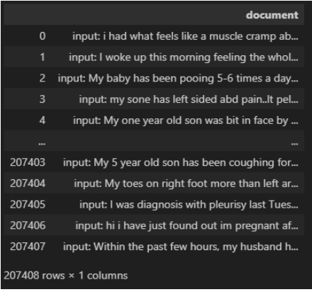

<h2 id="otCNt">目录与环境</h2>
环境：Python3.10

请按照requestments文档安装依赖

本组件使用了三个模型请确定安装的版本和位置，请安装在当前目录'./model下

模型包括：all-MiniLM-L6-v2

en_core_sci_scibert 版本为0.5.4

en_core_web_trf 版本为3.8.0

将.env.examlple文件改为.env
在.env文件中填写API_KEY和URL以及模型的名字


<h2 id="cqoJI">输入数据准备</h2>
1、将RAG检索文档进行划分，存储为一个csv文件，其中每一行为一个文档，列名为document

例如：

【注】文档划分时单个文档长度大小不应高于512个token，本方案使用的是all-MiniLM-L6-v2进行检索文档的嵌入，请将模型文件（config.json等必要文件）放置在'./model/all-MiniLM-L6-v2'文件夹下

2、将数据文档放置在相对路径为'./data'的位置，命名为'data.csv'


<h2 id="Ur1Tq">执行</h2>
```python
python get_protection.py --p 50 --n false
```

--p：str类型，替换率，用以控制实体替换比率以适应不同的有用性与隐私性的平衡要求，0~100，表示需要进行替换的实体比率

--n：bool类型，用户决定是否需要为命名体识别阶段启用补充模型


结果会存放在当前目录的'./result目录下，包括failed_indices_df文件包含有在数值模糊阶段没有正确处理的文档的序号num_replace_result_df包含数值模糊的结果final_result包含最后得到的保护数据replace_entities_dic.json包含了被替换的文本和对应的候选替换选项


